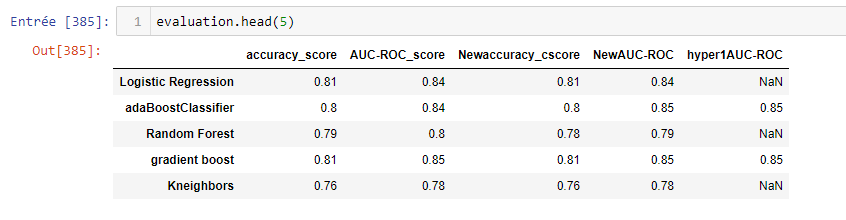

# Customer churn prediction
**L' attrition**, également connu sous le nom de **désabonnement des clients** , le chiffre d'affaires des clients, ou défections de clients, est la perte de clients.**Les banques , les sociétés de services téléphoniques, les fournisseurs de services Internet , les sociétés de télévision payante, les compagnies d' assurance et les services de surveillance** des alarmes utilisent souvent l'analyse de l'attrition des clients et les taux d'attrition des clients comme l'un de leurs principaux paramètres commerciaux (avec les flux de trésorerie, l' EBITDA , etc.) parce que le coût de la conservation d'un client existant est bien moindre que celui de l' acquisition d'un nouveau .
Dans le processus d'onboarding client pour entreprises qui ont des services Saas ,ces techniques sont souvent utilisées par le département marketing..

Se basant sur les données de la compagnie d'une téléphonie, le but de ce projet sera d'analyser les données et les tendances qui seront utiles pour le département marketing et aussi de prédire si un client va se désabonner ou pas.

# Author
 **Jean Marie Mandeng**  
Msc Student in Big Data Marketing and Management at Toulouse Business School. 
<a href="https://www.linkedin.com/in/jean-marie-mandeng/">My Linkedln </a>
